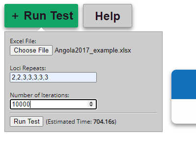
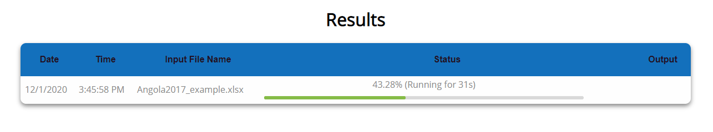

# Anti-malarial MCMC Bayesian Algorithm (v1.0)


An application for running recrudescence tests on malaria data, created as part of the Georgia Tech Junior Design 2020 class. Built in collaboration with Dr. Mateusz Plucinski and the Georgia Tech 0100 team, and based on Dr. Plucinski's [original R code](https://github.com/MateuszPlucinski/BayesianMicrosatellite) and [research](https://aac.asm.org/content/59/10/6096).

## Online Usage

For most users, the best and easiest option is to use our online application without installing anything! Visit this link to use it:

[<<Final URL TBD>>]()

### Using the Online GUI


You can learn more about how to run a new recrudescence test itself on your data by clicking the "Help" button. As a quick overview, though:

1.  Click the "Run Test" button



2.  Submit the input file you want to analyze
3.  Submit your known loci repeat values
4.  Select how many iterations to run your file for (10000 is a good starting value)
5.  Hit "Run Test"; you should see the test begin running with a loading bar:



See the help menu or our [Frequently Asked Questions page](https://docs.google.com/document/d/14xnfxBzDkTYQqryIv3YDtga34cPTaUkFUND-bL-N7UY/edit?usp=sharing) for more details and explanations on running the program.

## Installing Locally

If needed, you can also run this program on your own computer without an internet connection! This is most useful for developers who want to update and test the code.

### Prerequisites

Any modern desktop or laptop computer can run this application. Before beginning:

1.  [Clone or download](https://docs.github.com/en/free-pro-team@latest/github/creating-cloning-and-archiving-repositories/cloning-a-repository) this GitHub repository to your computer
2.  Ensure you have the following programs installed:

-   [Python 3.8+](https://www.python.org/downloads/)
-   [pip](https://pip.pypa.io/en/stable/installing/)
-   [npm](https://www.npmjs.com/get-npm)

3.  Navigate in your command line to the [root folder](https://www.lifewire.com/what-is-a-root-folder-or-root-directory-2625989) of this project, wherever you downloaded/cloned it. If you're unfamiliar with this, there are plenty of tutorials available for [Windows](https://www.howtogeek.com/659411/how-to-change-directories-in-command-prompt-on-windows-10/) and [Mac/Linux](https://www.lifewire.com/uses-of-command-cd-2201063)

### Installing Libraries

1.  On your command line, install the Python packages via pip by running the following command (this might take several minutes):

```bash
pip install .
```

> TROUBLESHOOTING: If this gives you any errors, you can manually install the necessary packages one-by-one via pip (if you aren't sure how to do this, see this [pip installer guide](https://packaging.python.org/tutorials/installing-packages/)):
>
>    ```bash
>    pip install numpy
>    pip install pandas
>    pip install scipy
>    pip install bottleneck
>
>    pip install flask
>    pip install flask-restful
>    pip install flask_limiter
>    ```

2.  (Optional) If you want to develop for this project, make sure to also install [pytest](https://docs.pytest.org/en/stable/getting-started.html) to run our unit tests and verify the code is working

```bash
pip install pytest
```

3.  Install all the graphical user interface (GUI) packages by running `npm install` - that's it!

```bash
npm install
```

### Running the Local Application

There are 2 ways to run the application locally: with a graphical user interface (GUI), or as a script from the command line. Most users will find the GUI application easier to use, but either one works!

#### Running the GUI

1.  In a new command line window, navigate to the root folder and run `npm run start-api`
2.  In a separate command line window, navigate to the root folder and run `npm run start` to start running the GUI. When the application starts, you should be presented with a screen like this:


You can then follow the regular GUI usage guide.

#### Running the Script

1.  Open `main.py` in your text editor of choice (e.g. Notepad or TextEdit); if needed, change the line `inputfile = "Angola2017_example.xlsx"` to the name of your `.xlsx` input file
2.  (Optional) If needed, you can also adjust other settings in this file, such as the number of iterations
3.  In your command line, run the main program via `python main.py` in this project's root folder

You should see the program begin running and printing to your console, and generating `.csv` output files upon completion.

> TROUBLESHOOTING: If the program stops running with an error, double-check that the path to your input file is correct

For more details on running this program and understanding the output, see our [Frequently Asked Questions](https://docs.google.com/document/d/14xnfxBzDkTYQqryIv3YDtga34cPTaUkFUND-bL-N7UY/edit?usp=sharing) page.

#### To Run Unit Tests

If you're a developer and have been making changes to the code, you can make sure nothing's broken by running our unit test suite.

1.  In your command line, run `pytest tests` in the project's root folder to execute all currently existing unit tests. Upon completion, pytest should print out any tests that failed.

### Troubleshooting

#### How do I know if I'm in the right root folder?

Once you've opened the command line, run the `dir` command on Windows or the `pwd` command on Mac/Linux. If you're in the right place, you should see a bunch of text ending with the `anti-malarial-MCMC-bayesian-algorithm` folder name.

```bash
(..)/anti-malarial-MCMC-bayesian-algorithm
```

#### I tried to run one of these commands, but it says `command not found` or `"X" is not recognized as an internal or external command`

First, double-check that you spelled the command name correctly (especially the first word); it's possible you just misspelled something. If you're still getting issues, try reinstalling the first 3 downloads - [Python 3.8+](https://www.python.org/downloads/), [pip](https://pip.pypa.io/en/stable/installing/), and [npm](https://www.npmjs.com/get-npm).

#### I installed all the `pip` libraries, but when I try to run everything Python complains they're not installed!

On some computers, there might already be an older version of Python where the libraries are being installed instead of the current one. Trying replacing `pip` with `pip3` when installing the libraries to specify you want to install everything to Python 3. If things still aren't working, check the [pip guide](https://packaging.python.org/tutorials/installing-packages/) for troubleshooting tips.

#### I tried changing the test input parameters, but it gave me some unexpected output/isn't working

Check our [Frequently Asked Questions](https://docs.google.com/document/d/14xnfxBzDkTYQqryIv3YDtga34cPTaUkFUND-bL-N7UY/edit?usp=sharing) page for more information on using the application once it's running.

## Release Notes

### v. 1.0

New features:

-   Added a Frequently Asked Question's page to the GUI, based on Dr. Plucinski's input
-   The GUI's `Status` section now properly displays error messages when a test fails
-   Advanced statistic files can now be downloaded together in a `.zip` folder from the GUI
-   Updated output file labels to be more readable
-   Added an "Estimated Completion Time" that appears before running a new test
-   Updated the API's JSON response format and documentation to include all output statistics
-   Added more specific error responses to the Flask API server
-   Added basic anti-DOS security features to the Flask API server
-   8x improved performance due to various optimizations (including multithreading individual site runs)
-   Completed a full integration test audit of the code's output

Bugfixes:

-   The API now accepts `locirepeats` inputs properly
-   Fixed several rare indexing errors in `define_alleles`
-   Removed unused `Logout` button from the GUI
-   Fixed `likelihood_ratio` giving incorrect responses for arrays with `NaN` values

Known Issues:

-   Closing the "Run New Test" GUI menu and re-opening it won't preserve your input file settings
-   Running a test with `iterations` set to 1 will cause an error (this bug was also discovered in the original R code)
-   The loading bar occasionally gets stuck at 100% before the run finishes (as it currently only estimates the runtime)
-   `switch_hidden` output is slightly off from expected values from the R code (currently failing a unit test)
-   `<site>_summary_statistics.csv` has unexpectedly high Simpson's Diversity Index values for some inputs
-   Currently, only the English language is supported
-   Per discussions with our client, database support for saving tests and user accounts were not included in this release
